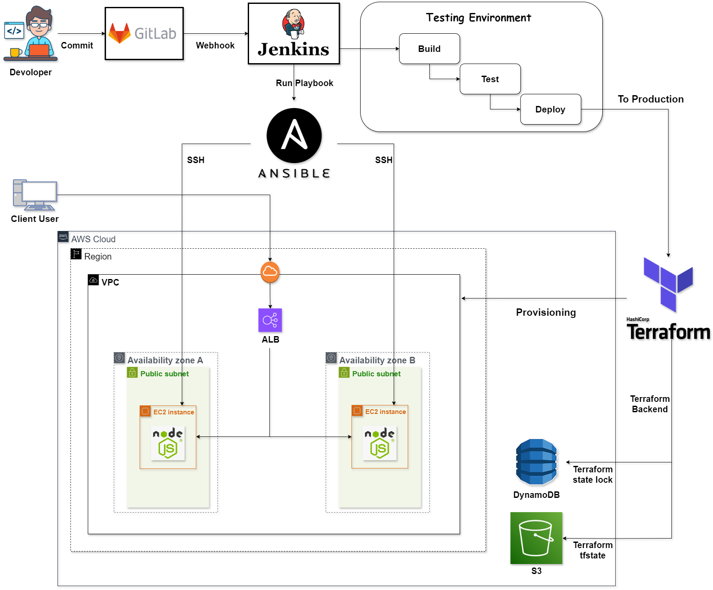

# Node.js-Deployment-Pipeline-on-AWS
This repository contains the configuration files and scripts for deploying a Node.js application on AWS using GitLab, Jenkins, Terraform, and Ansible.

## Overview

The deployment pipeline works as follows:

1. The developer pushes code changes to a GitLab private server.
2. GitLab triggers a webhook, which starts a Jenkins pipeline.
3. Jenkins retrieves the code changes from GitLab, builds the application, and runs tests.
4. If the tests pass, Jenkins triggers the deployment process.
5. Terraform creates the necessary infrastructure on AWS, including VPC, subnets, security groups, load balancer, and EC2 instances.
6. Terraform outputs the public IP addresses of the EC2 instances, which are used to create an Ansible inventory file.
7. Ansible copies the Node.js service file to the EC2 instances, deploys the application code, installs dependencies using `npm install`, and starts the Node.js service.

## Prerequisites

Before running the pipeline, ensure you have the following:

- GitLab private server set up and configured
- Jenkins server set up and configured
- Terraform installed and configured with AWS credentials
- Ansible installed
- AWS credentials with the necessary permissions

## Terraform

Terraform is used to create the full infrastructure on AWS. The Terraform configuration creates a VPC, two subnets in different availability zones, an internet gateway, a route table for the public subnets, a security group for the EC2 instances, an Application Load Balancer, two EC2 instances, and an Elastic IP for each EC2 instance.

## Jenkins

The Jenkins pipeline is defined in the `Jenkinsfile`. It defines the stages of the pipeline and uses a Jenkins agent to run the pipeline. It also sets the AWS access key ID and secret access key as environment variables.

## Ansible

Ansible is used to set up the application on the EC2 instances. The Ansible playbook copies the Node.js service file and the application code to the EC2 instances, installs the npm modules, and starts the Node.js service.

## Node.js Service

The Node.js service is defined in a service file. It specifies how to run the Node.js application as a service.

## Getting Started

To get started with this project, you need to have Terraform, Jenkins, and Ansible installed. You also need to have access to a GitLab private server and an AWS account.

Once you have these prerequisites, you can clone the repository and start the Jenkins pipeline to deploy the application.

## Contributing

Contributions are welcome. Please make a pull request.

## License

This project is licensed under the MIT License.
